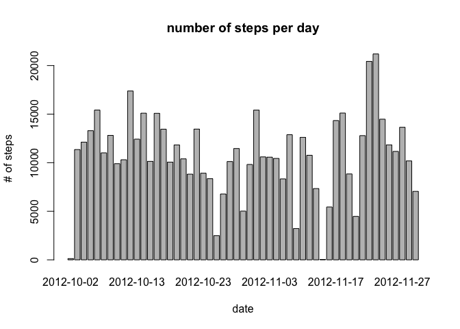
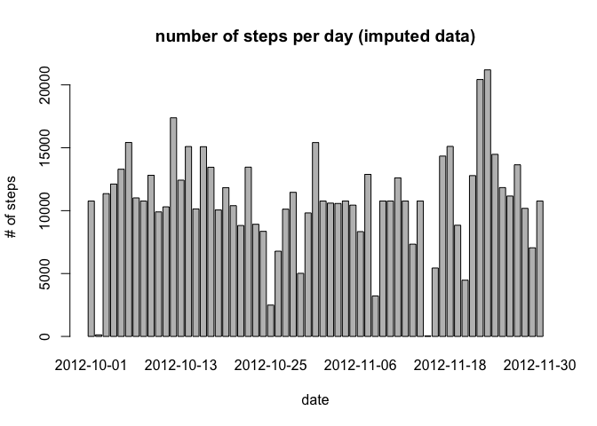
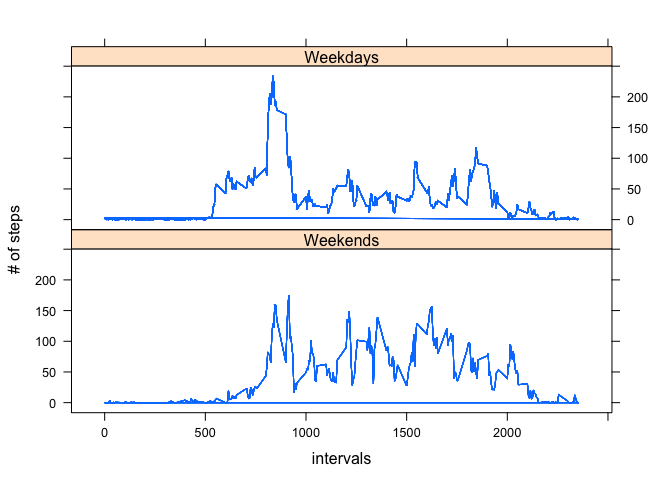

# Reproducible Research: Peer Assessment 1

## Loading and preprocessing the data


```r
library(ggplot2)
acti = read.csv('activity.csv')
```

###Make a histogram of the total number of steps taken each day, the NA values are dropped.


```r
steps_per_day <- (tapply(acti$steps, acti$date, FUN = sum))
steps_per_day <- steps_per_day[!is.na(steps_per_day)]
barplot(steps_per_day, xlab = 'date', ylab = '# of steps')
title('number of steps per day')
```

 

### What is mean total number of steps taken per day?

Compute the mean steps of each day

```r
mean(steps_per_day)
```

```
## [1] 10766.19
```

Compute the median steps of each day

```r
median(steps_per_day)
```

```
## [1] 10765
```


## What is the average daily activity pattern?

```r
avg_5_mins <- tapply(acti$steps, acti$interval, FUN =mean, na.rm=TRUE)
plot(unique(acti$interval), avg_5_mins, type = 'l', xlab = 'intervals', ylab='# of steps')
title(main = 'average of steps per unit interval')
```

 

## Imputing missing values

### Compute number of rows with missing value

```r
nrow(acti) - nrow(na.omit(acti))
```

```
## [1] 2304
```

###Create a new dataset that is equal to the original dataset but with the missing data filled in.
In here, we replace the missing value with mean of that interval.

```r
acti2 = acti
acti2[is.na(acti), 1] = sapply(acti[is.na(acti), 3], FUN = function(x, y){y[toString(x)]}, y=avg_5_mins)
```

### make histogram

```r
steps_per_day2 <- tapply(acti2$steps, acti2$date, FUN = sum, na.rm = FALSE)
steps_per_day2 <- steps_per_day2[!is.na(steps_per_day2)]
barplot(steps_per_day2, xlab = 'date', ylab = '# of steps ')
title(main = 'number of steps per day (imputed data)')
```

 

Compute the mean steps of each day

```r
mean(steps_per_day2)
```

```
## [1] 10766.19
```

```r
#mean_per_day <- tapply(acti2$steps, acti2$date, FUN = mean, na.rm = FALSE)
#print(mean_per_day[!is.na(mean_per_day)], type='html')
```

The obtained mean value is the same as the previous one, this is what we expected, because the imputated value is already the mean of each 5 minutes, summing up for all the intervals in a specific day,  we still obtain the mean of total steps for each day. 


Next we compute the median steps of each day, it happens to be the same as the mean, This shows that the median is t the newly imputated value.

```r
median(steps_per_day2)
```

```
## [1] 10766.19
```


## Are there differences in activity patterns between weekdays and weekends?
First we add new variable to indicate weekdays and define a new dataframe

```r
library(lattice)
acti3 = na.omit(acti)
days = weekdays(as.POSIXct(acti3[,2]))
acti3$weekdays = (days != 'Saturday' & days != 'Sunday')
acti_weekdays <- acti3[acti3$weekdays,]
acti_weekends <- acti3[!acti3$weekdays,]
```

Next we compute the mean number of steps for weekdays and weekends separately.
We apply the xyplot function in lattice package demonstrate the result. 

```r
acti3$avg = 0
acti3[acti3$weekdays, 'avg'] <- tapply(acti_weekdays$steps, acti_weekdays$interval, FUN =mean, na.rm=TRUE)
acti3[!acti3$weekdays, 'avg'] <- tapply(acti_weekends$steps, acti_weekends$interval, FUN =mean, na.rm=TRUE)
xyplot(avg~interval|weekdays, data = acti3,type='l', xlab = 'intervals', ylab='# of steps', strip = strip.custom(factor.levels = c('Weekends', 'Weekdays')), layout=c(1,2))
```

 

###Observation
Interestingly, we can observe that the activity patterns of the the user are quite different
between weekdays and weekends.

In the weekdays, the user usually starts walking very early, and reaches the higher peak than in the weekend.


```r
library(reshape)
res <- tapply(acti3$steps, acti3$weekdays, FUN = max)
names(res) <- c('weekends', 'weekdays')
print(res)
```

```
## weekends weekdays 
##      785      806
```

However, in the weekend, the average activity is highter than in the days.  This seems to suggest the user tends to do more activity rather than staying at home.

```r
res <- tapply(acti3$steps, acti3$weekdays, FUN = mean )
names(res) <- c('weekends', 'weekdays')
print(res)
```

```
## weekends weekdays 
## 43.07837 35.33796
```

